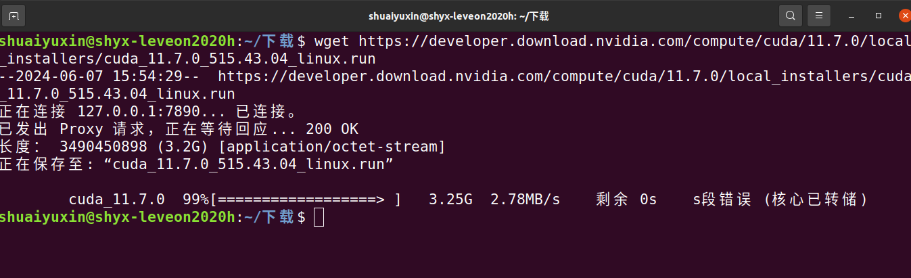
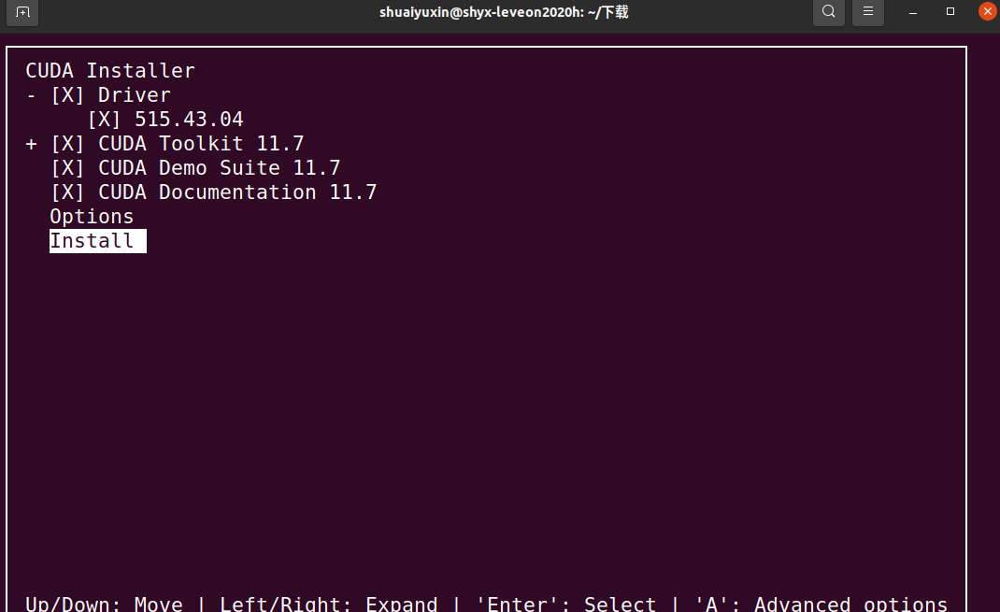
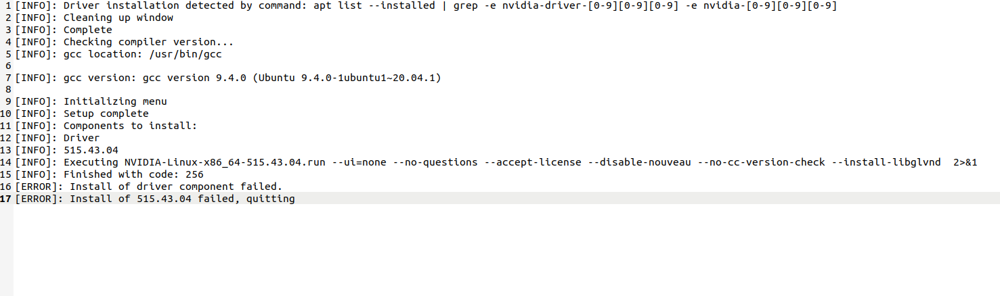
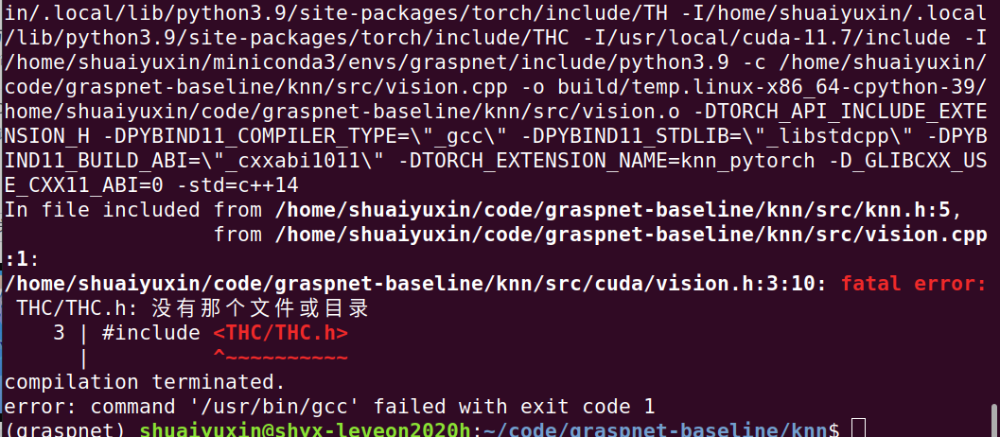

#### 1. 安装驱动

##### 内核问题

```
Unable to load the kernel module 'nvidia.ko'. This happens most   
     frequently when this kernel module was built against the wrong or   
     improperly configured kernel sources, with a version of gcc that   
     differs from the one used to build the target kernel, or if another
     driver, such as nouveau, is present and prevents the NVIDIA kernel
     module from obtaining ownership of the NVIDIA device(s), or no NVIDIA 
     device installed in this system is supported by this NVIDIA Linux
     graphics driver release.                       

​     Please see the log entries 'Kernel module load error' and 'Kernel   
​     messages' at the end of the file '/var/log/nvidia-installer.log' for 
​     more information.
```

描述：安装驱动时，无法识别内核版本

原因：驱动版本过高或修改编译过内核，导致驱动无法识别

解决办法：更新到常用驱动版本


#### 2.CUDA安装

##### 中断问题



描述：下载总是中断，极其难绷

原因：未配置代理，也没有镜像源，没有从中断点开始下

解决办法：配置代理、保存常用轮子等包到U盘、中断点下载，运行下面命令即可

```
wget- c https://developer.download.nvidia.com/compute/cuda/11.4.0/local_installers/cuda_11.3.0_465.19.01_linux.run
```


##### run文件运行错误



错误日志：

描述：安装失败

原因：重复安装驱动

解决办法：选择界面取消安装驱动，且不进行apt update操作


#### 3.程序运行错误



问题：cuda中没有对应的函数

原因：新版本取消了这个函数

解决办法：torch版本切换为1.6

解决连接：https://blog.csdn.net/qq_36891089/article/details/124353149

注意事项：torch1.6最高只能支持python3.8,所以必须先把python版本切换为3.8，才能切换torch1.6，这个有点难受

